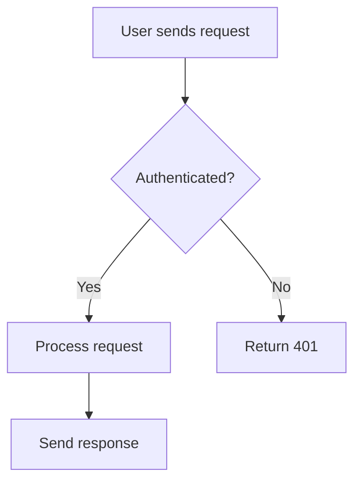
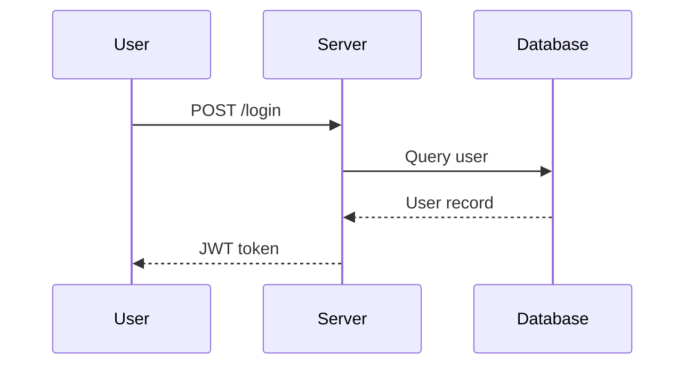
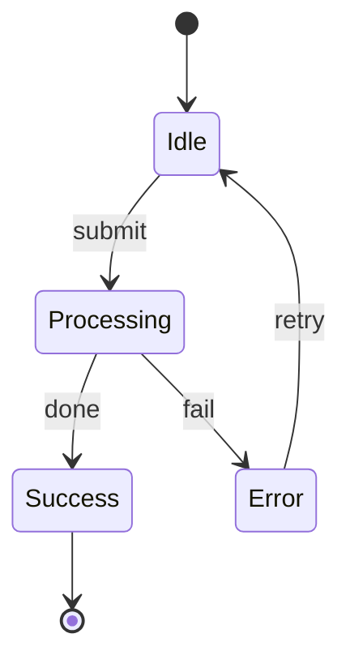

# Explain — Visual Step-by-Step Explanations

Generate a rich, visual Markdown explanation and save it to a tmp file so the user
can open it in a previewer that renders Mermaid diagrams.

## Workflow

1. **Understand the question** — Figure out exactly what the user wants explained.
   If ambiguous, ask one clarifying question before proceeding.

2. **Research if needed** — Read relevant source files, docs, or code to ensure
   accuracy. Never guess when you can look.

3. **Write the explanation** — Create a Markdown file with the structure below.

4. **Save and report** — Write the file to `$TMPDIR/explain-<slug>.md` (where
   `<slug>` is a short kebab-case summary of the topic). Tell the user the path
   so they can open it.

## Writing Guidelines

The goal is to make complex things feel approachable. Write as if you're explaining
to a curious colleague — not dumbing things down, but making sure every step is
clear before moving to the next.

- **Use Mermaid diagrams liberally.** Every explanation should include at least 2-3
  diagrams. Pick the right diagram type for the content:
  - `flowchart TD/LR` — for processes, decision trees, control flow
  - `sequenceDiagram` — for interactions between components/services/people
  - `classDiagram` — for data structures, class hierarchies
  - `stateDiagram-v2` — for state machines, lifecycle
  - `erDiagram` — for data models, relationships
  - `gantt` — for timelines, phases
  - `graph` — for dependency graphs, architecture overviews
  - `pie` — for proportions, breakdowns
  - `mindmap` — for concept maps, topic overviews

- **Alternate between text and visuals.** Don't dump all diagrams at the end.
  Weave them into the narrative — explain a concept in words, then immediately
  reinforce it with a diagram.

- **Use numbered steps.** Break the explanation into clear stages. Each step should
  have a heading, a short prose explanation, and (where helpful) a diagram.

- **Use concrete examples.** Abstract explanations are hard to follow. Ground each
  concept in a specific, relatable example.

- **Use callouts for important points.** Use blockquotes (`>`) to highlight key
  takeaways, common mistakes, or "aha" moments.

- **Keep individual sections short.** If a section is getting long, split it.
  Readers should feel like they're making progress.

## Output Template

````markdown
# <Topic Title>

<One-paragraph overview of what this explanation covers and why it matters.>

```mermaid
<overview diagram — a high-level map of the topic>
```

---

## Step 1: <First Concept>

<Prose explanation>

```mermaid
<supporting diagram>
```

> **Key takeaway:** <one-sentence summary of this step>

---

## Step 2: <Next Concept>

...continue the pattern...

---

## Summary

<Brief recap tying everything together.>

```mermaid
<final diagram — a complete picture showing how all the pieces connect>
```
````

## Example: Mermaid Diagram Styles

Here are examples of well-formatted Mermaid blocks to reference:

**Flowchart:**
````markdown

````

**Sequence Diagram:**
````markdown

````

**State Diagram:**
````markdown

````

## Mermaid Pitfall — Half-width Parens in Labels

**The one recurring breakage has a single root cause:** half-width parens `(` `)`
inside a mermaid block collide with mermaid's node-shape syntax (`()`, `(())`,
`([])`, etc.). Mermaid parses them as shape markers, not as label text, and the
whole diagram fails to render. This is **one of three** recurring breakages — the
others are reserved-keyword node IDs and stateDiagram chained transitions (see the
next sections).

### The one rule

> **Inside any mermaid code block, replace half-width `(` `)` in label / text
> content with full-width `（` `）`. No exceptions.**

Applies to every diagram type:
- `graph` / `flowchart` node labels (including inside `["..."]` — quoting does NOT escape parens)
- `mindmap` node text
- `gantt` task names
- `sequenceDiagram` の participant alias label（`as ...` の後）/ Note / message text / `box` 名
- `pie` label strings
- `subgraph` titles

### Real examples that broke

| Where | What was written | How mermaid parsed it |
|---|---|---|
| `mindmap` node | `2 plugin (Synth + Effect) 並行 build` | `(Synth + Effect)` = rounded-shape opener → unclosed → fail |
| `gantt` task | `段 0c-1 step (iii-b) page render` | `(iii-b)` = shape syntax collision |
| `graph` node `["..."]` | `RunLoop::Run() 呼べなかった` | `()` = shape syntax, fails even inside `["..."]` |

### Exceptions (keep half-width)

- Intentional mermaid syntax like `root((text))` (mindmap root node) — that IS the syntax, not a label.
- Plain markdown text **outside** mermaid code blocks.

### Verify after each block

After writing each mermaid block, scan it for stray non-syntactic `(` `)` and
replace them with `（` `）`. One stray paren is enough to break the whole block.

## Mermaid Pitfall — Reserved Keywords as Node IDs

**The second recurring breakage:** a **node ID** (the identifier *before* `[...]`,
not the label text inside it) that equals a mermaid reserved keyword collides with
the grammar and fails the whole diagram. Only the ID matters — the label can say
anything.

### The rule

> **Never use a bare mermaid keyword as a node ID:** `graph`, `flowchart`,
> `subgraph`, `end`, `class`, `style`, `click`, `linkStyle`, `direction`, `state`.

### Real example that broke

| Where | What was written | How mermaid failed |
|---|---|---|
| flowchart node ID | `userland -->\|"..."\| graph["WebAudio graph"]` | `Parse error ... got 'GRAPH'` — the ID `graph` is lexed as the reserved token, not a node name (the label "WebAudio graph" is innocent) |

### The fix

Rename the **ID** (the label stays as-is):
- `graph["WebAudio graph"]` → `audiograph["WebAudio graph"]`
- `end["Done"]` → `endNode["Done"]`

> **Tip:** prefix/suffix any "conceptual" ID so it never equals a bare keyword
> (`audioGraph`, `webGraph`, `endNode`). A node ID that is *exactly* a keyword fails;
> `audiograph` is safe.

## Mermaid Pitfall — stateDiagram Chained Transitions

**The third recurring breakage is diagram-type-specific:** in `stateDiagram-v2`, a
chained transition `A --> B --> C` written on one line fails to parse. `flowchart`
/ `graph` accept chaining (`A --> B --> C` is valid there), so the habit carries
over from those diagrams and breaks — but stateDiagram accepts only **one
transition per statement**.

### The rule

> **In `stateDiagram-v2`, write one transition per line: `A --> B`, then `B --> C`.
> Never chain `A --> B --> C` on a single line.** (flowchart/graph chaining is fine
> — this pitfall is stateDiagram-only.)

### Real example that broke

| Where | What was written | How mermaid failed |
|---|---|---|
| `stateDiagram-v2` composite state | `s1 --> s2 --> s3` | `Parse error ... got '-->'` — after the first `s1 --> s2` it expects a newline/statement; the second `-->` is unexpected |

### The fix

Split into one statement per line (the node descriptions stay as-is):
- `s1 --> s2 --> s3` → `s1 --> s2` then on the next line `s2 --> s3`

## Important Notes

- The output file MUST be saved to a tmp directory (`$TMPDIR`), not the project.
- Use `open <filepath>` to suggest the user open it, but do NOT run `open` yourself.
- File name format: `explain-<topic-slug>.md` (e.g., `explain-git-rebase.md`)
- Write in the same language the user used to ask the question.
