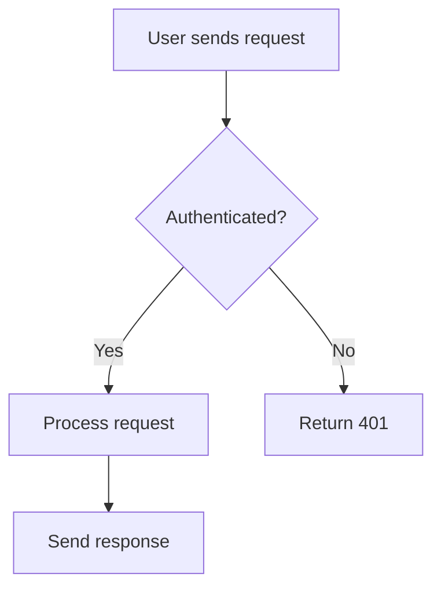
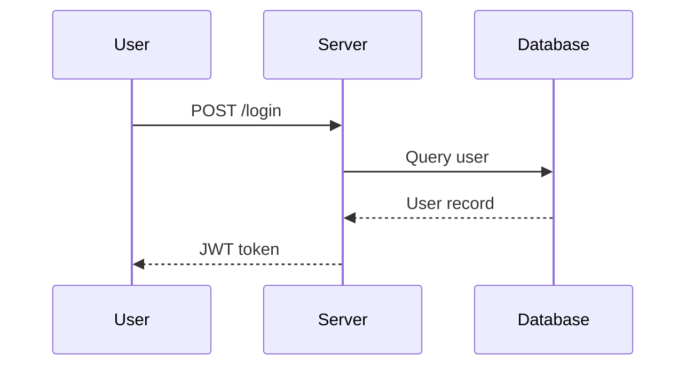
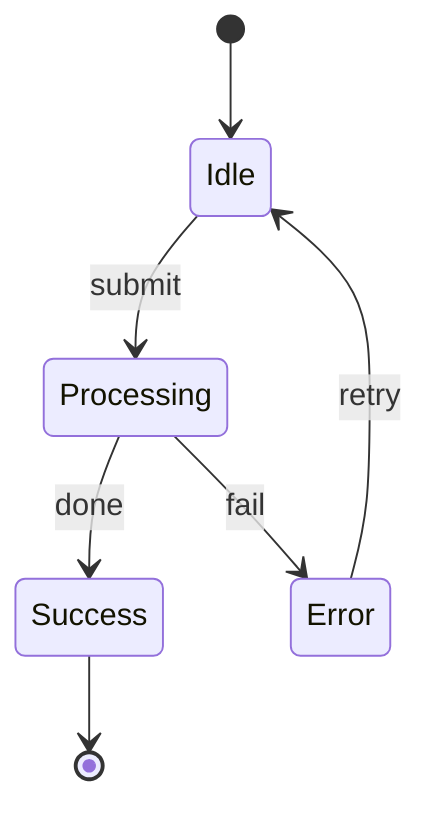

# Explain — Visual Step-by-Step Explanations

Generate a rich, visual Markdown explanation and save it to a tmp file so the user
can open it in a previewer that renders Mermaid diagrams.

## Workflow

1. **Understand the question** — Figure out exactly what the user wants explained.
   If ambiguous, ask one clarifying question before proceeding. Also decide **what
   the reader may not know yet** (e.g. the topic leans on OAuth, gRPC, a state
   machine they've never touched): those prerequisites go *into* the document as a
   「理解に必要な最低限」 section, not as an assumption.

2. **Research if needed** — Read relevant source files, docs, or code to ensure
   accuracy. Never guess when you can look. If research shows the source material
   (an issue body, a spec) is wrong or has been superseded by a comment, **resolve it
   now** — the document will show only the resolved version (see
   「認知コストを下げる書き方」 below).

3. **Write the explanation** — Create a Markdown file with the structure below,
   following 「認知コストを下げる書き方」 as hard rules.

4. **Save and report** — Write the file to `$TMPDIR/explain-<slug>.md` (where
   `<slug>` is a short kebab-case summary of the topic). Tell the user the path
   so they can open it.

## Writing Guidelines

The goal is to make complex things feel approachable. Write as if you're explaining
to a curious colleague — not dumbing things down, but making sure every step is
clear before moving to the next.

- **Use Mermaid diagrams liberally.** Every explanation should include at least 2-3
  diagrams. Pick the right diagram type for the content:
  - `flowchart TD/LR` — for processes, decision trees, control flow
  - `sequenceDiagram` — for interactions between components/services/people
  - `classDiagram` — for data structures, class hierarchies
  - `stateDiagram-v2` — for state machines, lifecycle
  - `erDiagram` — for data models, relationships
  - `gantt` — for timelines, phases
  - `graph` — for dependency graphs, architecture overviews
  - `pie` — for proportions, breakdowns
  - `mindmap` — for concept maps, topic overviews

- **Alternate between text and visuals.** Don't dump all diagrams at the end.
  Weave them into the narrative — explain a concept in words, then immediately
  reinforce it with a diagram.

- **Use numbered steps.** Break the explanation into clear stages. Each step should
  have a heading, a short prose explanation, and (where helpful) a diagram.

- **Use concrete examples.** Abstract explanations are hard to follow. Ground each
  concept in a specific, relatable example.

- **Use callouts for important points.** Use blockquotes (`>`) to highlight key
  takeaways, common mistakes, or "aha" moments.

- **Keep individual sections short.** If a section is getting long, split it.
  Readers should feel like they're making progress.

## 認知コストを下げる書き方（必須・累犯 FB）

ユーザーから繰り返し受けた FB。**図が正しくても、これを外すと「読みづらい」で全面やり直しになる。**
読み手に「脳内で対応表を持たせる」「差分を取らせる」「数字を覚えさせる」行為を全部やめる。

### Rule 1 — 番号ではなく名前で呼ぶ。対応表は先頭に 1 回だけ

issue 番号・PR 番号・commit hash・ファイル行番号・バージョン番号を本文に散らさない。
冒頭に「この文書で使う名前」の表を置き、以降はその名前で参照する。

| Bad | Good |
|---|---|
| 「#33915 は #34124 の子で、#34123 と兄弟。#33915 の Node 側は PR #5 の上に積む」 | 先頭の表で `#34124 = 親 issue / #33915 = ローカル版 / #34123 = ChatGPT 版 / PR #5 = ツール整理 PR` と定義し、本文は「ローカル版は親 issue の子。MCP Server 側はツール整理 PR の上に積む」 |
| 「`base.py:201-209` の `ApiKeyAuthenticatedView.dispatch` が…」を本文で連呼 | 本文は「認可判定は `views/api/base.py` の 1 箇所」まで。行番号は末尾の「出典」にだけ書く |
| 「local main は origin/master より 144 commit 遅れ、`d539b83` = origin/main」 | 「手元の checkout は無関係な作業 branch。新 branch は `master` から切る」。commit hash と遅れ数は書かない |

### Rule 2 — 数値は 1 枚の表に集約する

寿命・秒数・件数・上限のような数値は「数値はここだけ」という表を 1 つ作り、本文の散文には入れない。
判断に効かない数値（PyPI の公開日、changelog の日付、行数）は捨てる。

| Bad | Good |
|---|---|
| 「access token は 36000 秒（既定と同じ）、refresh は 90 日、device code は 600 秒、ポーリングは 5 秒、待機は 40 秒、最終利用日時は 1 時間おき…」が本文の各所に散る | §「数値はここだけ」に 7 行の表（項目 / 値 / 根拠）。本文は「トークン寿命は表のとおり」 |
| 「3.4.1 は 2026-08-21 公開、3.4.0 は 07-24、3.3.0 は 05-29…」 | 「認可ライブラリの版は 3.4.1（device flow の承認画面を本人の依頼にだけ効かせる修正入り）」。日付は書かない |

### Rule 3 — 訂正前の情報を見せない。最終形だけ書く

元資料（issue 本文など）が後続コメントで「読み替え」られている、あるいは裏取りで間違いと分かった場合、
**最初から読み替え後・裏取り後の正しい情報だけ**を書く。「本文は X と言っているが実際は Y」の往復は、
読み手に一度間違いを読ませてから訂正する行為で、メリットが無い。
元資料を直すべき箇所は、末尾に「元資料を直す箇所」として **短い一覧** で別置きする。

| Bad | Good |
|---|---|
| 「issue は PKCE で守ると書いているが、コメントで『device flow に PKCE は無い』と読み替えが入った。なので PKCE ではなく…」 | grant の比較表に「PKCE: Authorization Code では必須 / Device flow では使わない（守るのは確認コード・短い期限・レート制限）」とだけ書く。末尾の一覧に「PKCE の記述: device flow では使わない（コメントで読み替え済み）」 |
| 「issue は `EXTRA_SERVER_KWARGS={"expires_in":600}` で寿命を変えると書いているが、oauthlib の `DeviceApplicationServer` は kwargs を捨てるので効かない。したがって…」 | 「device code の寿命は設定値では変えられない。ライブラリの device 用サーバークラスを継承して寿命を渡し、連携開始窓口の view に差す」。末尾の一覧に「device code の寿命: 設定値 → 継承クラス」 |

### Rule 4 — 読者が知らない前提は本文に組み込む

「詳しくない」と言われた概念（OAuth、gRPC、状態遷移…）は、**理解に必要な最低限**を本文のセクションとして書く。
順番は「登場人物 → 用語の違い → 仕組みを 1 ステップずつ → なぜその設計か」。専門用語には役割名を添える
（例: `device-authorization/` を「連携開始窓口」と呼び、表で URL に対応づける）。
絵中心の別建てが要るときは `/eli5` を併用する（説明本体の代わりにはしない）。

| Bad | Good |
|---|---|
| 「Device Authorization Grant（RFC 8628）で、`/oauth/device-authorization/` に POST して device_code を得て `/oauth/token/` をポーリングする」だけ | §「OAuth を理解するための最低限」に 10 小節（登場人物 4 者 / API キーとトークンの違い / トークンが 2 枚ある理由 / client と public / scope / grant の 2 種類と選ぶ理由 / device flow を 1 ステップずつ / 確認コードの意味 / 失効 / 後続で足すもの）。窓口は役割名 + URL の表 |

### Rule 5 — 必要のない詳細を削り、出典は末尾に集約する

本文は「判断と理解に効くこと」だけ。git の細部、ライブラリ changelog の引用、調査の過程、API 呼び出しの生ログは書かない。
一次資料の `file:line` は AGENTS.md 等が求める場合でも、**末尾の「出典」セクション**にまとめて置く。

### Rule 6 — 冒頭に「一行で言うと」

タイトル直下に、結論を 1〜2 文で。読み手はそこだけ読んで先に進むか決められる。

### Rule 7 — 図のメッセージは「役割名」で終わらせず、実際の操作を書く

sequenceDiagram の各矢印には **メソッド + URL + 送る/返る主要フィールド** を書く。
直前の表で「連携開始窓口 = `POST /oauth/device-authorization/`」と定義したなら、図の矢印も
その URL で書く（役割名だけの矢印は、読み手に表と図の突き合わせをさせる）。
返事が複数種類あるなら「返事 / 意味 / 受け手の動き」の表を添え、リクエストとレスポンスの
**実例（JSON や生の HTTP）を 1 つずつ** 置く。

| Bad | Good |
|---|---|
| `M->>O: 連携開始窓口に client_id と scope` | `M->>O: POST /oauth/device-authorization/<br/>client_id=固定値, scope=mcp` |
| `O-->>M: まだ / 拒否された / 期限切れ / トークン` | `O-->>M: error=authorization_pending / access_denied / expired_token<br/>または 200 access_token, refresh_token` ＋ 下に 5 行の「返事 / 意味 / 動き」表 ＋ JSON 実例 |
| 「未ログインなら /login/ に寄ってから戻る」を矢印 1 本に潰す | `alt 未ログイン` ブロックで `302 /login/?next=…` → `ログインして next に戻る` を明示 |

判定ロジック（middleware の分岐など）は文で書かず、`flowchart` の菱形で分岐を描く。

### Rule 8 — 別名を作らない。プロトコル / ライブラリの名前をそのまま使い、用語表は図より前に置く

フィールド名（`user_code`）に日本語の呼び名（確認コード）を当てると、読み手は毎回「確認コード ↔ user_code」の
翻訳をさせられる。**呼び名のレイヤーは作らない。** wire / ライブラリ上の名前（`user_code`、`device_code`、
`access_token`、DeviceGrant…）をそのまま図・本文・コード例で使い、「名前 / 何か / 誰が持つ」の用語表を、
その用語を使う最初の図より前に置く。元資料（issue 本文など）が別名を使っていて、まだ着手前なら、
**元資料の側を実名に寄せる提案**を「元資料を直す箇所」に入れる（ユーザーは「着手前なのに名前を変える判断が
なぜできないのか」と怒った）。利用者向け画面のラベル文言だけは別問題として実装時に決める。

| Bad | Good |
|---|---|
| 「呼び名 / 実際の名前」の 2 列表を作り、図は「確認コード」、JSON は `"user_code"`、下に「`user_code` = 確認コード」の読み方リスト | 「名前 / 何か / 誰が持つ」の 3 列表に `user_code` を 1 行。図も本文も JSON も `user_code` |
| `device_code` を「依頼コード」「依頼の合言葉」と言い換えて段落ごとに揺れる | どこでも `device_code` |
| `device_code` を説明せずに図で使い、末尾の早見表で初めて定義 | 用語表を §2 の先頭に置く（「先に用語を並べ、中身は以降で順に説明する」と一言添える） |
| 状態遷移図の状態名を「保留中 / 許可済み」と意訳 | ライブラリの status 値（`authorization-pending` / `authorized` / `denied` / `expired`）をそのまま状態名にする |

### 保存前のセルフチェック

- [ ] 本文（§0 の対応表と末尾の出典を除く）に `#数字` の issue / PR 参照が残っていない（`grep -n '#[0-9]\{4,\}'`）
- [ ] 本文の散文に秒数・件数・commit hash・日付が残っていない
- [ ] 「〜と書いてあるが実際は」「〜だったが訂正」の往復が無い
- [ ] 読者が知らない前提概念のセクションがある（必要な場合）
- [ ] sequenceDiagram の矢印が役割名だけで終わっていない（メソッド + URL + 主要フィールド）。分岐は菱形で描いてある
- [ ] フィールド名・status 値に日本語の別名を当てていない（`user_code` は `user_code`）。用語表がその用語を使う最初の図より前にある
- [ ] 数値の表・出典・元資料を直す箇所、が末尾側にまとまっている

## Output Template

````markdown
# <Topic Title>

一行で言うと: **<結論を 1〜2 文>**

<この文書の順番を 1 行で>

## 0. この文書で使う名前

| 名前 | 実体 |
|---|---|
| **<短い名前>** | <issue 番号 / repo パス / PR / ライブラリ名など、本文で二度と書かない実体> |
| ... | ... |

```mermaid
<overview diagram — a high-level map of the topic. ラベルは §0 の名前で>
```

---

## 1. <First Concept>

<Prose explanation。番号・数値・行番号は書かない>

```mermaid
<supporting diagram>
```

> **Key takeaway:** <one-sentence summary of this step>

---

## 2. <読者が知らない前提があればここ: 「〜を理解するための最低限」>

<登場人物 → 用語の違い → 仕組みを 1 ステップずつ → なぜその設計か。専門用語には役割名を添える>

---

## N. <Next Concept>

...continue the pattern...

### N.x 数値はここだけ

| 項目 | 値 | 根拠 |
|---|---|---|
| ... | ... | ... |

---

## 決めること（推奨つき）  ← 判断が要る場合のみ

| # | 決めること | 推奨 |
|---|---|---|

## 元資料を直す箇所  ← 元資料に誤りがあった場合のみ。短い一覧

- <箇所>: <誤 → 正>

## Summary

<Brief recap tying everything together.>

```mermaid
<final diagram — a complete picture showing how all the pieces connect>
```

## 出典

- <repo>: `path:line`, ...   ← file:line はここに集約
````

## Example: Mermaid Diagram Styles

Here are examples of well-formatted Mermaid blocks to reference:

**Flowchart:**
````markdown

````

**Sequence Diagram:**
````markdown

````

**State Diagram:**
````markdown

````

## Mermaid Pitfall — Half-width Parens in Labels

**The one recurring breakage has a single root cause:** half-width parens `(` `)`
inside a mermaid block collide with mermaid's node-shape syntax (`()`, `(())`,
`([])`, etc.). Mermaid parses them as shape markers, not as label text, and the
whole diagram fails to render. This is **one of three** recurring breakages — the
others are reserved-keyword node IDs and stateDiagram chained transitions (see the
next sections).

### The one rule

> **Inside any mermaid code block, replace half-width `(` `)` in label / text
> content with full-width `（` `）`. No exceptions.**

Applies to every diagram type:
- `graph` / `flowchart` node labels (including inside `["..."]` — quoting does NOT escape parens)
- `mindmap` node text
- `gantt` task names
- `sequenceDiagram` の participant alias label（`as ...` の後）/ Note / message text / `box` 名
- `pie` label strings
- `subgraph` titles

### Real examples that broke

| Where | What was written | How mermaid parsed it |
|---|---|---|
| `mindmap` node | `2 plugin (Synth + Effect) 並行 build` | `(Synth + Effect)` = rounded-shape opener → unclosed → fail |
| `gantt` task | `段 0c-1 step (iii-b) page render` | `(iii-b)` = shape syntax collision |
| `graph` node `["..."]` | `RunLoop::Run() 呼べなかった` | `()` = shape syntax, fails even inside `["..."]` |

### Exceptions (keep half-width)

- Intentional mermaid syntax like `root((text))` (mindmap root node) — that IS the syntax, not a label.
- Plain markdown text **outside** mermaid code blocks.

### Verify after each block

After writing each mermaid block, scan it for stray non-syntactic `(` `)` and
replace them with `（` `）`. One stray paren is enough to break the whole block.

## Mermaid Pitfall — Reserved Keywords as Node IDs

**The second recurring breakage:** a **node ID** (the identifier *before* `[...]`,
not the label text inside it) that equals a mermaid reserved keyword collides with
the grammar and fails the whole diagram. Only the ID matters — the label can say
anything.

### The rule

> **Never use a bare mermaid keyword as a node ID:** `graph`, `flowchart`,
> `subgraph`, `end`, `class`, `style`, `click`, `linkStyle`, `direction`, `state`.

### Real example that broke

| Where | What was written | How mermaid failed |
|---|---|---|
| flowchart node ID | `userland -->\|"..."\| graph["WebAudio graph"]` | `Parse error ... got 'GRAPH'` — the ID `graph` is lexed as the reserved token, not a node name (the label "WebAudio graph" is innocent) |

### The fix

Rename the **ID** (the label stays as-is):
- `graph["WebAudio graph"]` → `audiograph["WebAudio graph"]`
- `end["Done"]` → `endNode["Done"]`

> **Tip:** prefix/suffix any "conceptual" ID so it never equals a bare keyword
> (`audioGraph`, `webGraph`, `endNode`). A node ID that is *exactly* a keyword fails;
> `audiograph` is safe.

## Mermaid Pitfall — stateDiagram Chained Transitions

**The third recurring breakage is diagram-type-specific:** in `stateDiagram-v2`, a
chained transition `A --> B --> C` written on one line fails to parse. `flowchart`
/ `graph` accept chaining (`A --> B --> C` is valid there), so the habit carries
over from those diagrams and breaks — but stateDiagram accepts only **one
transition per statement**.

### The rule

> **In `stateDiagram-v2`, write one transition per line: `A --> B`, then `B --> C`.
> Never chain `A --> B --> C` on a single line.** (flowchart/graph chaining is fine
> — this pitfall is stateDiagram-only.)

### Real example that broke

| Where | What was written | How mermaid failed |
|---|---|---|
| `stateDiagram-v2` composite state | `s1 --> s2 --> s3` | `Parse error ... got '-->'` — after the first `s1 --> s2` it expects a newline/statement; the second `-->` is unexpected |

### The fix

Split into one statement per line (the node descriptions stay as-is):
- `s1 --> s2 --> s3` → `s1 --> s2` then on the next line `s2 --> s3`

## Important Notes

- The output file MUST be saved to a tmp directory (`$TMPDIR`), not the project.
- Use `open <filepath>` to suggest the user open it, but do NOT run `open` yourself.
- File name format: `explain-<topic-slug>.md` (e.g., `explain-git-rebase.md`).
  Name it by **topic**, not by issue number (`explain-lapras-mcp-link-auth.md`,
  not `explain-issue-33915.md`).
- Write in the same language the user used to ask the question.
- Run the 「保存前のセルフチェック」 (see 認知コストを下げる書き方) and the three
  Mermaid pitfall scans before reporting the path.
- The TUI reply is one line + the path (+ at most a few bullets). The document is
  the deliverable; don't paste its contents into the terminal.
